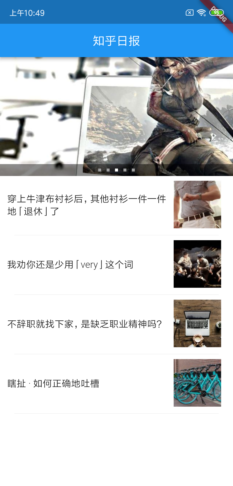
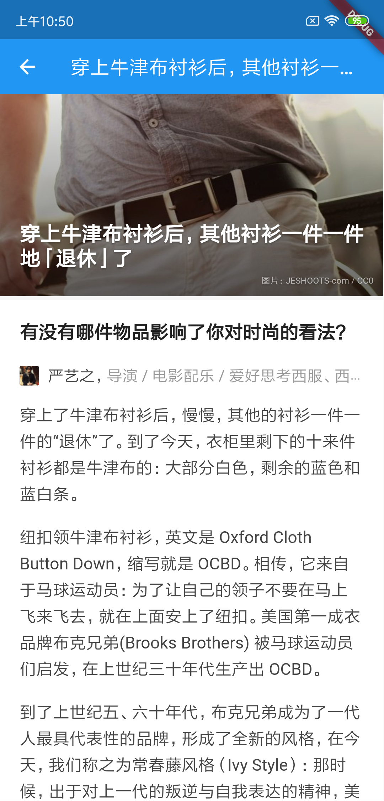

### 功能

本工程，实现类一个最小化的知乎日报Demo，主要功能：
1、展示知乎日报列表；

> 

2、展示详情页信息；

> 

**主要运用的Flutter知识点：**
1、dio实现数据加载；

2、使用flutter_webview_plugin插件实现详情页加载；

3、使用ListView控件

4、Banner控件的使用

5、图片加载

6、Flutter的路由

### 知乎日报的api分析来源：

本工程使用的api参考了一下两篇文章 
1、https://gist.github.com/ameizi/f3f320a512030292362d
2、https://github.com/izzyleung/ZhihuDailyPurify/wiki/%E7%9F%A5%E4%B9%8E%E6%97%A5%E6%8A%A5-API-%E5%88%86%E6%9E%90